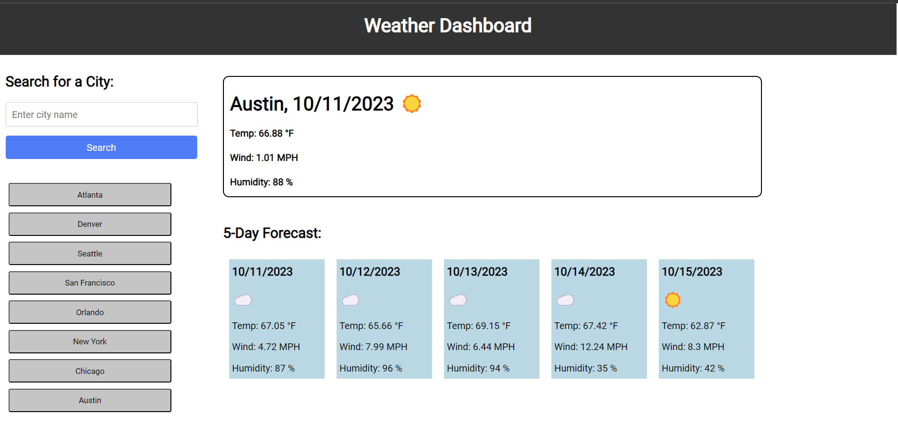

## Weather Dashboard

# Description

This Weather Dashboard is designed to retrieve weather data for a specified city. Upon page load, users are presented with current weather information and a 5-day forecast for Austin. The forecast displays the date, an emoji corresponding to the weather condition, temperature, wind speed, and humidity. Users can also view weather details for other cities by either clicking the preset buttons or entering a desired city into the search bar.

This project showcases my newly acquired skills in utilizing APIs, accessing their datasets, and manipulating the retrieved data to fit specific requirements.

[Link to website](https://vincula1.github.io/weatherdash/)